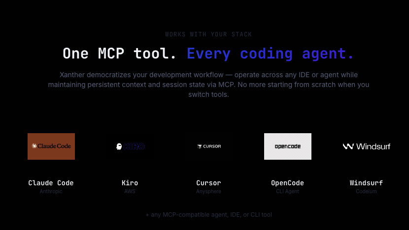

# Xanther Context Engine (XCE) — MCP Server

<p align="center">
  
</p>

<p align="center">
  <strong>Give your coding agent deep codebase understanding via MCP.</strong>
</p>

<p align="center">
  <a href="https://xanther.ai">Website</a> •
  <a href="https://app.xanther.ai">Dashboard</a> •
  <a href="https://discord.gg/Y768kBRS">Discord</a> •
  <a href="https://github.com/Xanther-Ai/xanther-cli">Xanther CLI</a>
</p>

---

## What is XCE?

Xanther Context Engine (XCE) is an MCP server that gives your coding agent precise architectural context on every tool call. Instead of your agent guessing where things are in a codebase, XCE provides:

- **Architecture Context** — HLD, LLD, component descriptions for any file or symbol
- **Semantic Search** — find code by meaning, not just text matching
- **Traceability** — trace from a function up to its module-level architecture
- **Impact Analysis** — understand what's affected when files change

Powered by the **PRAT** (Persistent Recursive Abstract Tree) algorithm.

## Benchmark Results

<p align="center">
  
</p>

All results on [SWE-bench Verified](https://www.swebench.com/) using mini-swe-agent:

| Setup | Resolve Rate |
|---|---|
| Sonnet 4.0 (baseline) | 66.0% |
| **Sonnet 4.0 + XCE** | **73.4%** |
| Sonnet 4.0 + XCE (cascade hybrid) | 76.8% |
| MiniMax M2.5 (baseline) | 75.8% |
| **MiniMax M2.5 + XCE** | **78.2%** |

An older-generation model (Sonnet 4.0) with XCE beats raw Sonnet 4.6 and reaches Opus-level performance — at 16x lower cost.

## Quick Start

### 1. Get your API key

Sign up at [xanther.ai/signup](https://xanther.ai/signup) and generate an API key from the [dashboard](https://app.xanther.ai).

### 2. Index your repository

Use the [Xanther CLI](https://github.com/Xanther-Ai/xanther-cli) to index your codebase:

```bash
npx xanther-cli init --api-key xce_your_key_here
```

### 3. Add to your MCP config


#### Claude Code / Kiro / Cursor / Windsurf

Add this to your MCP configuration:

```json
{
  "mcpServers": {
    "xanther": {
      "url": "https://mcp.xanther.ai/sse",
      "headers": {
        "Authorization": "Bearer YOUR_API_KEY"
      }
    }
  }
}
```

#### OpenCode

```json
{
  "mcpServers": {
    "xanther": {
      "type": "sse",
      "url": "https://mcp.xanther.ai/sse",
      "headers": {
        "Authorization": "Bearer YOUR_API_KEY"
      }
    }
  }
}
```

That's it. Your agent now has access to XCE tools on every interaction.

## Available Tools

### `xce_search`

Semantic search across your indexed codebase. Finds code by meaning, not just text.

```
Query: "authentication middleware that validates JWT tokens"
→ Returns: matching functions, classes, and their architectural context
```

### `xce_architecture_context`

Get the full architectural context for any file or symbol — component description, low-level design, high-level design, and relationships.

```
File: "src/auth/middleware.py"
→ Returns: what it does, how it fits in the architecture, what depends on it
```

### `xce_trace`

Trace a symbol from code-level up to module-level architecture. Understand how a function connects to the broader system.

```
Source: "validate_token"
Target: "hld"
→ Returns: function → class → module → architectural role
```

### `xce_impact_analysis`

Analyze the impact of changing specific files. Know what breaks before you break it.

```
Changed files: ["src/auth/middleware.py", "src/auth/tokens.py"]
→ Returns: affected modules, downstream dependencies, risk assessment
```

## How It Works

```
┌─────────────────┐     MCP      ┌─────────────────┐
│  Coding Agent   │◄────────────►│   XCE Server    │
│  (Claude Code,  │              │                 │
│   Kiro, Cursor) │              │  PRAT Algorithm │
└─────────────────┘              │  + Graph Store  │
                                 └─────────────────┘
```

1. **Index** — Xanther CLI or GitHub App indexes your repo into a knowledge graph
2. **Connect** — Add the MCP config to your coding agent
3. **Query** — Your agent automatically calls XCE tools when it needs codebase context
4. **Context** — XCE returns precise architectural context, not just raw code

The agent doesn't need to read hundreds of files to understand your codebase. XCE gives it the right context instantly.

## Supported Agents

<p align="center">
  
</p>

| Agent | Status | Config Location |
|---|---|---|
| Claude Code | Supported | `~/.claude/mcp.json` |
| Kiro | Supported | `.kiro/settings/mcp.json` |
| Cursor | Supported | `.cursor/mcp.json` |
| Windsurf | Supported | `.windsurf/mcp.json` |
| OpenCode | Supported | `~/.config/opencode/config.json` |
| Any MCP client | Supported | Varies |

## Pricing

| Plan | Queries/month | Repos | Price |
|---|---|---|---|
| Free | 100 | 2 | $0 |
| Starter | 2,000 | 5 | $8/mo |
| Pro | 10,000 | 20 | $15/mo |
| Unlimited | Unlimited | Unlimited | $20/mo |

[View pricing →](https://xanther.ai/pricing)

## Links

- [Xanther Website](https://xanther.ai)
- [Dashboard](https://app.xanther.ai)
- [Xanther CLI](https://github.com/Xanther-Ai/xanther-cli)
- [Discord Community](https://discord.gg/Y768kBRS)
- [Benchmark Results](https://xanther.ai/benchmarks)

## License

MIT — see [LICENSE](LICENSE) for details.
